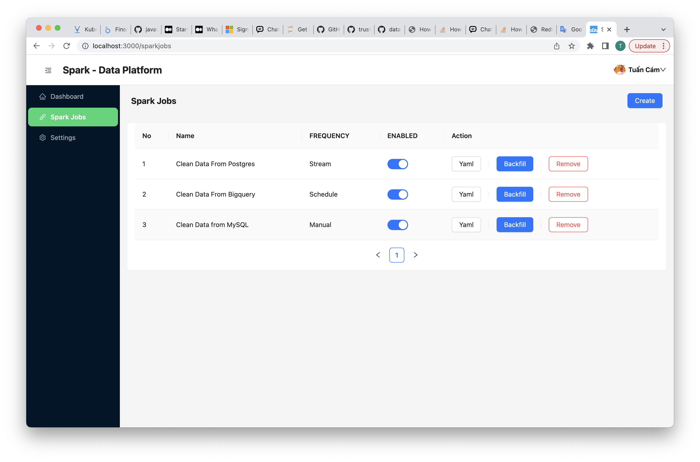
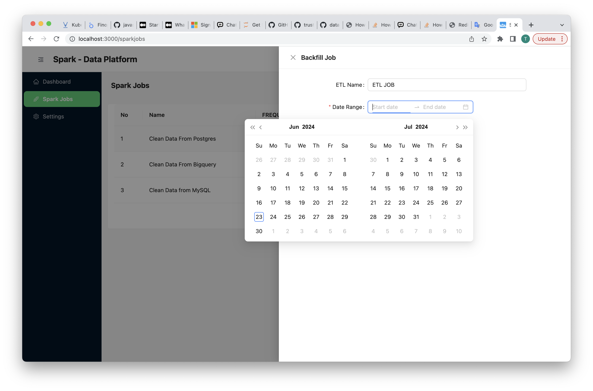
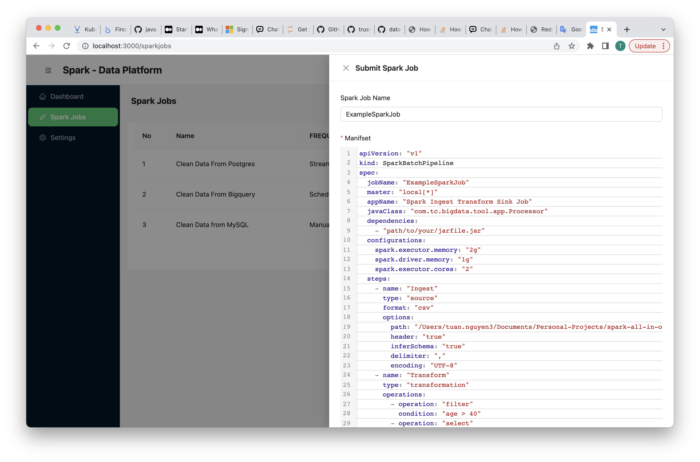

# ETL With Spark On K8S
This is a project to manage ETL Jobs with Spark include: 

- **Frontend**: Monitor Spark ETL Job and Visualize Data lineage Chart, Customize Yaml (Spark Generator Yaml) Configuration
- **Backend**: Manage Data Job, Logs
- **Spark Generator**: This is a tool , which to generte Spark ETL Job from yaml configuration.

[](https://hub.docker.com/r/vantuan12345/spark-generator/)
[](https://hub.docker.com/r/vantuan12345/gospark-generatordaddypy/)
[](https://hub.docker.com/r/vantuan12345/spark-generator/)


## FrontEnd
### View List Spark Job

<div align="center">
    
</div>

### Backfill Spark Job

<div align="center">
    
</div>

### Submit Spark Job

<div align="center">
    
</div>

# Spark Generator

### Configuration
Configuration for the Spark pipeline is loaded from a YAML file. Ensure you have a `spark-pipeline-config.yaml` file in the resources directory with the appropriate settings.
**Spark Job Pipeline Config**
Example `spark-pipeline-config.yaml`:
```yaml
apiVersion: "v1"
kind: SparkBatchPipeline
spec:
  jobName: "ExampleSparkJob"
  master: "local[*]"
  appName: "Spark Ingest Transform Sink Job"
  javaClass: "com.tc.bigdata.tool.app.Processor"
  dependencies:
    - "path/to/your/jarfile.jar"
  configurations:
    spark.executor.memory: "2g"
    spark.driver.memory: "1g"
    spark.executor.cores: "2"
  steps:
    - name: "Ingest"
      type: "source"
      format: "csv"
      options:
        path: "/path/data/input.csv"
        header: "true"
        inferSchema: "true"
        delimiter: ","
        encoding: "UTF-8"
    - name: "Transform"
      type: "transformation"
      operations:
        - operation: "filter"
          condition: "age > 40"
        - operation: "select"
          columns: ["name", "age", "address"]
        - operation: "withColumn"
          column: "newColumn"
          expression: "columnA + columnB"
    - name: "Sink"
      type: "write"
      format: "parquet"
      options:
        path: "/output"
        mode: "overwrite"
```
**K8S Spark Job Config**
Example `k8s_spark_job.yaml`:
```yaml
apiVersion: "sparkoperator.k8s.io/v1beta2"
kind: SparkApplication
metadata:
  name: spark-etl
  namespace: default
spec:
  type: Java
  mode: cluster
  image: "ghcr.io/tuancamtbtx/spark-build-tool:main"
  env:
    - name: SPARK_JOB_CONF_PATH
      value: "your_spark_pipeline_job_path_conf"
  imagePullPolicy: Always
  mainClass: com.tc.bigdata.tool.app.Processor
  mainApplicationFile: "local:///opt/spark/spark-build-tool.jar"
  sparkVersion: "3.5.1"
  sparkUIOptions:
    serviceLabels:
      test-label/v1: 'true'
  restartPolicy:
    type: Never
  volumes:
    - name: "test-volume"
      hostPath:
        path: "/tmp"
        type: Directory
  driver:
    cores: 1
    coreLimit: "1200m"
    memory: "512m"
    labels:
      version: 3.5.1
    serviceAccount: spark-operator-spark
    volumeMounts:
      - name: "test-volume"
        mountPath: "/tmp"
  executor:
    cores: 1
    instances: 1
    memory: "512m"
    labels:
      version: 3.5.0
    volumeMounts:
      - name: "test-volume"
        mountPath: "/tmp"
```

## Contributing
The project has a separate contribution file. Please adhere to the steps listed in the separate contributions [file](./CONTRIBUTING.md)

## License
[](./LICENSE)